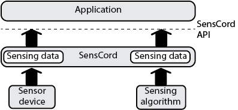
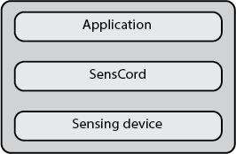
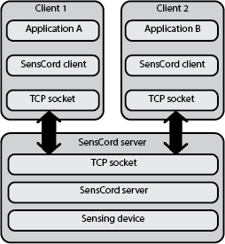
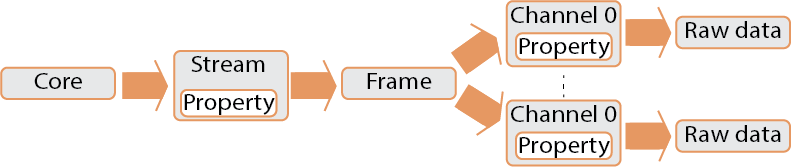
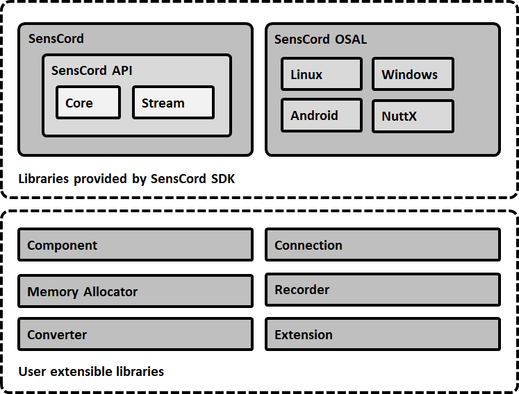

# SensCord

## Overview

This repository contains the source code and resources for the SensCord.

SensCord is a software framework that provides an environment where data acquisition and sensor configuration can be performed through common interfaces for a variety of sensors.

### Features

SensCord provides the APIs to access a variety of sensing data from sensor devices and sensing algorithms.

As seen in the image below, SensCord allows to access multiple sensing data at the same time. Each sensing data consists of data chunk and meta-data, and meta-data include the timestamp. The sensing data with timestamp is useful to design sensor fusion application.



SensCord API includes the interface to control the sensing device and sensing algorithm settings.

The API interface is the same regardless of the sensing device or the type of sensing data being accessed.

### Functionalities

SensCord provides various architectural functionalities such as:

 - Multiple API language support C, C++, C#, Python, Java, JavaScript, and WAMR (WebAssembly Micro Runtime)
 - Multiple OS support Windows, Linux, and Android
 - Multiple execution model support single application model and client-server application model
 - Multiple frame buffering model support

### Execution models

SensCord supports diverse execution models such as single thread, multi-thread, and multi-process. In addition, the SensCord architecture enables distributed execution, so that each software module can be operated in its ideal execution environment.

There are two execution models:

The single application model which assumes operation on the same process, and enables the use of SensCord resources from a single application.



The client-server model which enables simultaneous use of SensCord resources from multiple applications. In this mode, each SensCord clients are connected to the SensCord server by using socket communication and each client can run on the different machines.



### SensCord interfaces

SensCord consists of four main interfaces; Core, Stream, Frame, and Channel. You can use the functions provided by these interfaces to access sensing data.



### Software structure

SensCord supports various platforms. Therefore, user extensions are available for the parts that depend on the platform, and they can be freely built into the configuration of SensCord.
SensCord is configured with multiple function blocks as in below diagram.



## How to Build

For detailed build instructions, refer to the [build documentation](BUILD.md).

## Directory Structure
```
.
├── BUILD.md                            # Instructions for building the project
├── CODE_OF_CONDUCT.md                  # Project community guidelines
├── CONTRIBUTING.md                     # Contribution guide for external developers
├── LICENSE                             # Project license information
├── PrivacyPolicy.md                    # Privacy policy for users of the project
├── README.md                           # Project overview and usage instructions
├── SECURITY.md                         # Information on reporting security vulnerabilities
├── application/                        # Example applications and usage samples for SensCord
├── cmake/                              # CMake build scripts and configuration files
├── csharp/                             # C# bindings and wrapper implementations
├── doc/                                # Documentation resources
├── include/                            # Public header files for the SensCord API
├── java/                               # Java language bindings and samples
├── lib/                                # Core library source code
│   ├── allocator/                      # Memory allocation management components
│   ├── component/                      # Modular software components of SensCord
│   ├── connection/                     # Sensor connection management modules
│   ├── converter/                      # Data format conversion and transformation modules
│   ├── core/                           # Core functionality and main SensCord logic
│   ├── osal/                           # OS abstraction layer supporting multi-platform compatibility
│   ├── python/                         # Python bindings for SensCord
│   ├── recorder/                       # Data recording modules
│   ├── server/                         # Client-server implementation for distributed operation
│   └── wamr/                           # WebAssembly Micro Runtime integration
├── python/                             # Python samples and utility scripts
├── sample/                             # Sample code demonstrating SensCord features
├── scripts/                            # Utility scripts for building, testing, and automation
├── template/                           # Project and code templates for extension or customization
├── tools/                              # Additional development tools and utilities
└── utility/                            # Utility modules shared across the project
```

## Contribution

We welcome contributions to this project!
Issues and pull requests are welcome and we appreciate bug reports, feature requests, and any contributions from the community.

For details on how to contribute, please see [CONTRIBUTING.md](CONTRIBUTING.md).
For our code of conduct, please see [CODE_OF_CONDUCT.md](CODE_OF_CONDUCT.md).

## Security

Please see the [SECURITY.md](SECURITY.md) file for information on reporting vulnerabilities and our security policy.

## License

This project is licensed under the Apache License 2.0.

Please see the [LICENSE](LICENSE) file for details.
